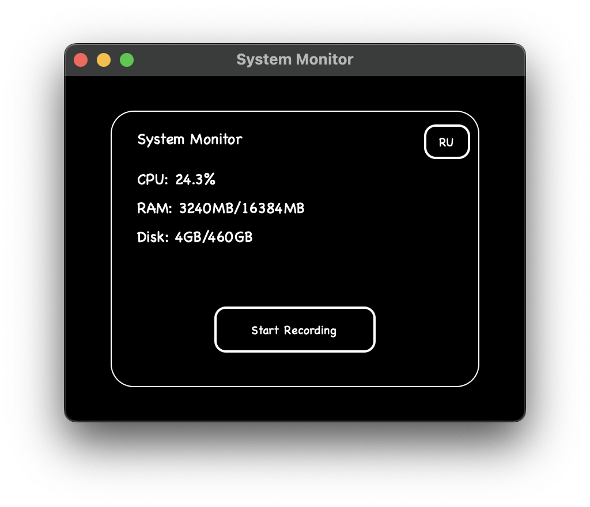

# System Monitor
<h1 align="center">
    <picture>
        <source media="(prefers-color-scheme: dark)" srcset=".github/interface_en.png">
        
    </picture>
</h1>

[RU](README.ru.md) | EN

## Description
A desktop application for monitoring system resources (CPU, RAM, disk) with data recording capabilities.

## System Requirements
- Operating System:
- Linux
- macOS
- Python 3.12+

## Features
- Real-time monitoring of system resources
- Recording data to SQLite database
- Switching between Russian and English interfaces
- Dark theme interface
- Resource usage history

## Installation

### Using Docker
```bash
./docker-build.sh
tar -xzf dist/system-monitor.tar.gz
```

### Manual Build
```bash
./build.sh
tar -xzf dist/system-monitor.tar.gz
```

### Running without building
1. Install Python 3.12 or higher
2. Install Poetry:
```bash
curl -sSL https://install.python-poetry.org | python3 -
```
3. Clone the repository and navigate to the project directory
4. Install dependencies:
```bash
poetry install
```
5. Run the application:
```bash
poetry run python src/__main__.py
```

## Usage
1. Launch the application from `dist/system-monitor-app/system-monitor`
2. Monitor real-time system resources
3. Click "Start Recording" to save data to SQLite database
4. Use language switch button to change interface language (Russian/English)

## Technical Details
- Python 3.12+
- Dependencies:
  - psutil
  - customtkinter
  - SQLite3
- Build system: Poetry + PyInstaller

## License
MIT License

## Author
Andrei Satsevich (andrei@satsevich.com)