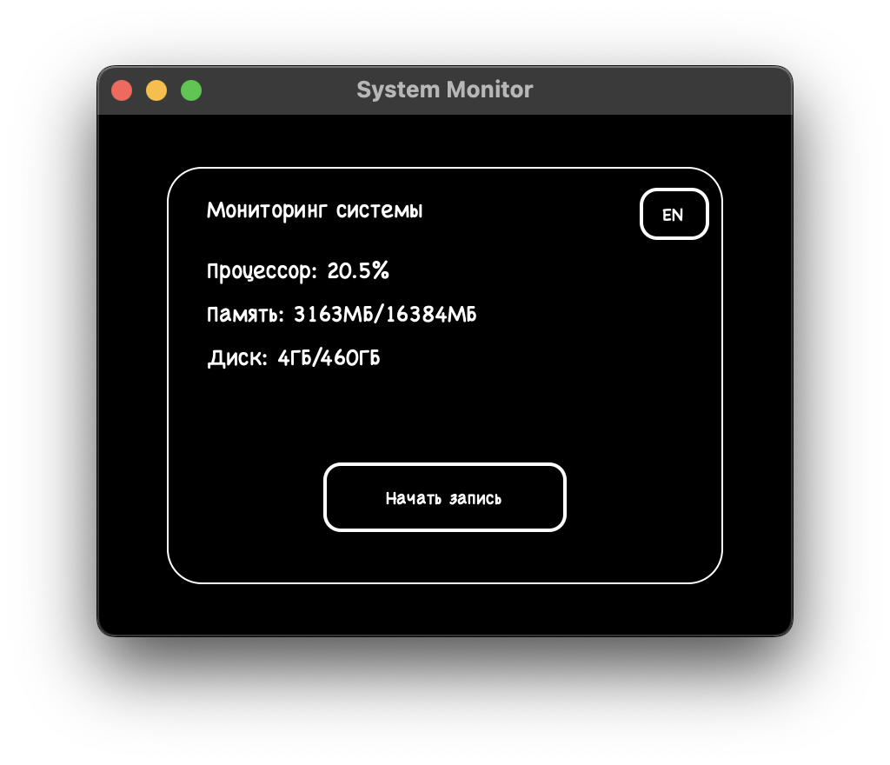

# Мониторинг системы
<h1 align="center">
    <picture>
        <source media="(prefers-color-scheme: dark)" srcset=".github/interface_ru.png">
        
    </picture>
</h1>
RU | [EN](README.md)

## Описание
Десктопное приложение для мониторинга системных ресурсов (процессор, память, диск) с возможностью записи данных.

## Системные требования
- Операционная система:
  - Linux
  - macOS
- Python 3.12+

## Возможности
- Мониторинг системных ресурсов в реальном времени
- Запись данных в базу SQLite
- Переключение между русским и английским интерфейсом
- Тёмная тема интерфейса
- История использования ресурсов

## Установка

### Используя Docker

```bash
./docker-build.sh
tar -xzf dist/system-monitor.tar.gz
```

### Ручная сборка
```bash
./build.sh
tar -xzf dist/system-monitor.tar.gz
```

### Запуск без сборки
1. Установите Python 3.12 или выше
2. Установите Poetry:
```bash
curl -sSL https://install.python-poetry.org | python3 -
```
3. Клонируйте репозиторий и перейдите в директорию проекта
4. Установите зависимости:
```bash
poetry install
```
5. Запустите приложение:
```bash
poetry run python src/__main__.py
```

## Использование
1. Запустите приложение из `dist/system-monitor-app/system-monitor`
2. Отслеживайте системные ресурсы в реальном времени
3. Нажмите "Начать запись" для сохранения данных в базу SQLite
4. Используйте кнопку переключения языка для смены языка интерфейса (Русский/Английский)

## Технические детали
- Python 3.12+
- Зависимости:
  - psutil
  - customtkinter
  - SQLite3
- Система сборки: Poetry + PyInstaller

## Лицензия
MIT License

## Автор
Андрей Сацевич (andrei@satsevich.com)